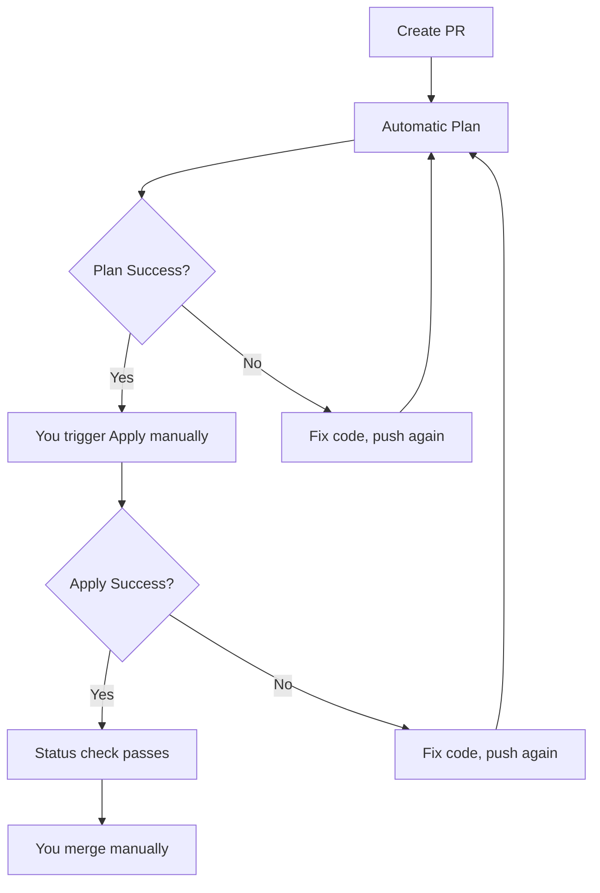

# Manual Terraform Workflow (Plan → Apply → Merge)

## 🎯 Overview

This is the **SAFEST** Terraform workflow:

1. ✅ **Automatic Plan** when you create PR
2. 🔒 **Manual Apply** that YOU trigger
3. ✅ **Branch Protection** prevents merge until apply succeeds
4. ✅ **Merge** only after confirming infrastructure works

**Key Benefit**: Complete control with zero risk!

---

## 🔄 How It Works



---

## 📋 Step-by-Step Guide

### Step 1: Create PR with Terraform Changes

```bash
git checkout -b feat/add-cloudfront-logging
cd terraform/s3-cloudfront

# Make your changes
vi main.tf

git add -A
git commit -m "feat: enable CloudFront access logging"
git push origin feat/add-cloudfront-logging
```

Create PR on GitHub.

---

### Step 2: Automatic Plan Runs

**GitHub will automatically:**

- ✅ Run `terraform plan`
- ✅ Post results to PR
- ✅ Save plan as artifact
- ✅ Create status check

**PR Comment Example:**

```markdown
## 🏗️ Terraform Plan - PR #42

#### 📋 Format Check: ✅ success

#### ⚙️ Initialization: ✅ success

#### 🤖 Validation: ✅ success

#### 📊 Plan: ✅ success

<details>
  <summary>📄 Show Full Plan</summary>
  
  Plan: 1 to add, 0 to change, 0 to destroy.
  
  + aws_s3_bucket.logs
    bucket = "us-law-severity-map-logs"
    ...
</details>

---

### 🎯 Next Steps

⏸️ **Waiting for manual approval**

**To apply this plan:**

1. Go to the Actions tab
2. Click "Run workflow"
3. Enter PR number: `42`
4. Click "Run workflow" button
5. Wait for apply to complete
6. If successful, you can merge this PR

**⚠️ Important**: This PR cannot be merged until apply succeeds!

---

**Plan saved as artifact**: `terraform-plan-42`
**Commit**: abc123
**Author**: @you
```

---

### Step 3: Review the Plan

**Check:**

- ✅ Resources being created/changed/destroyed
- ✅ No unexpected changes
- ✅ Costs look reasonable
- ✅ Security implications

**If plan looks wrong:**

```bash
# Fix it
vi terraform/s3-cloudfront/main.tf
git commit -am "fix: correct bucket name"
git push

# Plan will re-run automatically
```

---

### Step 4: Manually Trigger Apply

**When ready to apply:**

1. Go to: https://github.com/YOUR_USERNAME/us-law-severity-map/actions

2. Click on "Terraform Apply (Manual)" workflow

3. Click "Run workflow" button (top right)

4. Fill in the form:

   - **Use workflow from**: `main` (or your branch)
   - **PR number**: `42` (your PR number)

5. Click green "Run workflow" button

6. Watch it run! ⏱️ ~5-15 minutes


---

### Step 5A: Apply Succeeds ✅

**New PR Comment:**

```markdown
## ✅ Terraform Apply Successful!

Infrastructure has been successfully deployed/updated!

### 📊 Outputs

- **CloudFront Domain**: `d123abc.cloudfront.net`
- **S3 Bucket**: `us-law-severity-map`
- **S3 Website**: `us-law-severity-map.s3-website-us-east-1.amazonaws.com`

### 🌐 Test Your Infrastructure

- **CloudFront URL**: https://d123abc.cloudfront.net
- **S3 Direct**: http://us-law-severity-map.s3-website-us-east-1.amazonaws.com

### ✅ Ready to Merge

**This PR is now safe to merge!**

The infrastructure has been tested and verified in AWS.
All status checks should now pass.

---

**Applied by**: @you
**Workflow**: View logs
**Timestamp**: 2025-10-29T12:34:56Z
```

**Status Checks:**

- ✅ Terraform Plan
- ✅ Terraform Apply ← **Required before merge!**

**Labels:**

- ✅ `terraform-applied`
- ✅ `ready-to-merge`

**What to do:**

1. ✅ **Test the URLs** - verify infrastructure works
2. ✅ **Check AWS Console** - confirm resources
3. ✅ **Click "Merge pull request"**
4. ✅ Done! 🎉

---

### Step 5B: Apply Fails ❌

**New PR Comment:**

```markdown
## ❌ Terraform Apply Failed

Infrastructure deployment failed. **DO NOT MERGE THIS PR!**

### 🚨 Error Details

<details>
  <summary>Show Apply Log</summary>
  
  Error: creating S3 Bucket: BucketAlreadyExists
  ...
</details>

### 🔍 Common Issues

- AWS quota limits exceeded
- Insufficient IAM permissions
- Resource naming conflicts
- State lock issues
- Network/API errors

### 🛠️ Next Steps

1. **Review the error** above
2. **Fix the Terraform code**
3. **Push new commit** to this PR
4. **Wait for new plan** to run
5. **Run apply again** from Actions tab

### ⚠️ DO NOT MERGE

This PR cannot be merged until apply succeeds!
```

**Status Checks:**

- ✅ Terraform Plan
- ❌ Terraform Apply ← **Blocking merge!**

**Labels:**

- ❌ `terraform-apply-failed`
- ⚠️ `do-not-merge`

**What to do:**

1. ❌ **DO NOT MERGE!**
2. 🔧 **Fix the error**:
   ```bash
   vi terraform/s3-cloudfront/main.tf
   git commit -am "fix: use unique bucket name"
   git push
   ```
3. ⏱️ **Wait for plan** to re-run
4. 🔄 **Go to Step 4** - trigger apply again
5. ✅ Repeat until success

---

## ⚡ Quick Reference

### Check Plan Status

```bash
# View PR comments
gh pr view PR_NUMBER --comments

# View workflow runs
gh run list --workflow="Terraform Plan (PR)" --branch BRANCH_NAME
```

### Trigger Apply

```bash
# Using GitHub CLI
gh workflow run terraform-pr-apply.yml -f pr_number=42

# Or via web UI
https://github.com/YOUR_USERNAME/us-law-severity-map/actions/workflows/terraform-pr-apply.yml
```

### Check Apply Status

```bash
# View latest run
gh run list --workflow="Terraform Apply (Manual)"

# View logs
gh run view RUN_ID --log
```

### Merge PR

```bash
# Only after apply succeeds!
gh pr merge PR_NUMBER --squash
```

---

## 🔒 Branch Protection Rules

To enforce "apply before merge", configure these rules on `main` branch:

### In GitHub Settings → Branches → Branch Protection Rules

**Required:**

1. ✅ Require a pull request before merging
2. ✅ Require status checks to pass before merging
   - ✅ `Terraform Plan`
   - ✅ `Terraform Apply` ← **Key protection!**
3. ✅ Require branches to be up to date before merging

**Optional but Recommended:** 4. ✅ Require conversation resolution before merging 5. ✅ Require linear history 6. ✅ Include administrators (enforce rules for everyone)

### How to Configure

```bash
# 1. Go to GitHub repo settings
https://github.com/YOUR_USERNAME/us-law-severity-map/settings/branches

# 2. Click "Add rule" or edit existing rule for "main"

# 3. Enable:
☑️ Require a pull request before merging
  ☑️ Require approvals: 0 (or 1 if you want self-review)
  ☑️ Dismiss stale pull request approvals

☑️ Require status checks to pass before merging
  ☑️ Require branches to be up to date

  Search and add these status checks:
  ☑️ Terraform Plan
  ☑️ Terraform Apply

☑️ Require conversation resolution

☑️ Do not allow bypassing the above settings
  ☑️ Include administrators

# 4. Click "Create" or "Save changes"
```

**Result**:

- ❌ Merge button disabled until apply succeeds
- ✅ Forces proper workflow
- ✅ Prevents accidents

---

## 🎭 Example Scenarios

### Scenario 1: Happy Path

```bash
# 1. Create PR
git checkout -b feat/enable-encryption
# ... make changes ...
git push

# 2. Plan runs automatically ✅

# 3. Review plan in PR comment

# 4. Trigger apply manually
gh workflow run terraform-pr-apply.yml -f pr_number=42

# 5. Apply succeeds ✅

# 6. Test infrastructure - works! ✅

# 7. Merge PR
gh pr merge 42 --squash

# Done! 🎉
```

**Time**: ~20 minutes  
**Risk**: Zero  
**Confidence**: 100%

---

### Scenario 2: Apply Fails, Fix and Retry

```bash
# 1. Create PR
git push

# 2. Plan runs ✅

# 3. Trigger apply
gh workflow run terraform-pr-apply.yml -f pr_number=42

# 4. Apply fails ❌ (bucket name conflict)

# 5. Fix the issue
vi terraform/s3-cloudfront/variables.tf
# Change: bucket_name = "unique-name-xyz"
git commit -am "fix: use unique bucket name"
git push

# 6. Plan runs again ✅

# 7. Trigger apply again
gh workflow run terraform-pr-apply.yml -f pr_number=42

# 8. Apply succeeds ✅

# 9. Merge PR
gh pr merge 42 --squash

# Done! 🎉
```

**Time**: ~35 minutes (with one retry)  
**Risk**: Zero (never merged broken code)  
**Confidence**: 100%

---

### Scenario 3: Multiple Infrastructure Changes

```bash
# PR #42: Enable logging
# 1. Create PR → 2. Plan ✅ → 3. Apply ✅ → 4. Merge ✅

# PR #43: Add WAF
# 1. Create PR → 2. Plan ✅ → 3. Apply ✅ → 4. Merge ✅

# PR #44: Enable CDN caching
# 1. Create PR → 2. Plan ✅ → 3. Apply ✅ → 4. Merge ✅

# All done safely! ✅
```

---

## 🆚 Workflow Comparison

| Aspect         | Auto Apply (Risky)    | Manual Apply (Safe)   |
| -------------- | --------------------- | --------------------- |
| **Plan**       | Automatic             | Automatic             |
| **Apply**      | Automatic on merge    | Manual trigger        |
| **Merge**      | Anytime               | Only after apply      |
| **Control**    | Low                   | **High** ✅           |
| **Risk**       | High (blind merge)    | **Zero** ✅           |
| **Rollback**   | Hard (already merged) | **Easy** (not merged) |
| **Confidence** | Hope it works         | **Know it works** ✅  |
| **Best for**   | Trusted changes       | **Everything** ✅     |

---

## 🤔 FAQ

### Q: Why manual trigger instead of label?

**A**: More explicit! You go to Actions tab, see all workflows, and consciously click "Run". Harder to accidentally trigger.

### Q: Can I trigger apply multiple times?

**A**: Yes! If first apply fails, fix code and trigger again. Each run creates new logs.

### Q: What if I forget to trigger apply?

**A**: Branch protection prevents merge! The "Merge" button is disabled until apply succeeds.

### Q: Can someone else trigger apply for my PR?

**A**: Yes, anyone with write access can trigger workflows. Useful for team reviews.

### Q: What happens to the plan artifact?

**A**: Saved for 30 days. Apply tries to use it, but generates new plan if not found.

### Q: Can I apply without creating a PR?

**A**: No! This workflow only works with PRs. For ad-hoc changes, use `terraform apply` locally.

---

## 🛠️ Troubleshooting

### Apply button not showing up

**Check:**

- Workflow file is in `.github/workflows/` on **main** branch
- You have write access to the repo
- Refresh the Actions page

### Apply fails with "PR not found"

**Check:**

- PR number is correct (no # symbol, just the number)
- PR is still open (not closed/merged)
- You're triggering from correct repo

### Status check not appearing on PR

**Check:**

- Workflow completed (success or failure)
- Status check name matches exactly: `Terraform Apply`
- Branch protection is configured correctly

### Can't merge even after apply succeeds

**Check:**

- Status check is green (not yellow "pending")
- All required checks are passing
- No merge conflicts
- Branch is up to date

---

## 📊 Success Metrics

After using this workflow:

- ✅ **100% confidence** before merging
- ✅ **Zero** surprise failures in production
- ✅ **Complete control** over when changes apply
- ✅ **Easy rollback** if you change your mind
- ✅ **Clear audit trail** of who applied what
- ✅ **Better sleep** at night! 😴

---

## 🎓 Best Practices

1. **Always review plan** before triggering apply
2. **Test URLs** after apply succeeds
3. **Check AWS Console** to verify resources
4. **Document changes** in PR description
5. **Use semantic commits** for clear history
6. **Merge promptly** after apply (don't leave PRs hanging)
7. **Monitor costs** in AWS Cost Explorer
8. **Set up alerts** for unexpected changes

---

## 🚨 Emergency Procedures

### If apply is stuck

```bash
# 1. Cancel the workflow run
gh run cancel RUN_ID

# 2. Check Terraform state
cd terraform/s3-cloudfront
terraform state list

# 3. Check for state lock
aws dynamodb get-item --table-name terraform-locks --key '{"LockID": {"S": "us-law-severity-map/terraform.tfstate"}}'

# 4. If locked, force unlock (DANGER!)
terraform force-unlock LOCK_ID
```

### If infrastructure is broken

```bash
# Option 1: Rollback PR
gh pr revert PR_NUMBER

# Option 2: Emergency destroy
cd terraform/s3-cloudfront
terraform destroy -auto-approve

# Option 3: Manual AWS cleanup
# Go to AWS Console and delete resources manually
```

---

## 📈 Next Steps

1. ✅ Configure branch protection rules
2. ✅ Test the workflow with a small change
3. ✅ Train team members on the process
4. ✅ Set up AWS billing alerts
5. ✅ Document your infrastructure decisions
6. ✅ Celebrate your robust workflow! 🎉

---

**Last Updated**: October 29, 2025  
**Workflows**:

- `terraform-pr-plan.yml` (automatic)
- `terraform-pr-apply.yml` (manual)

**Status**: Production Ready ✅
